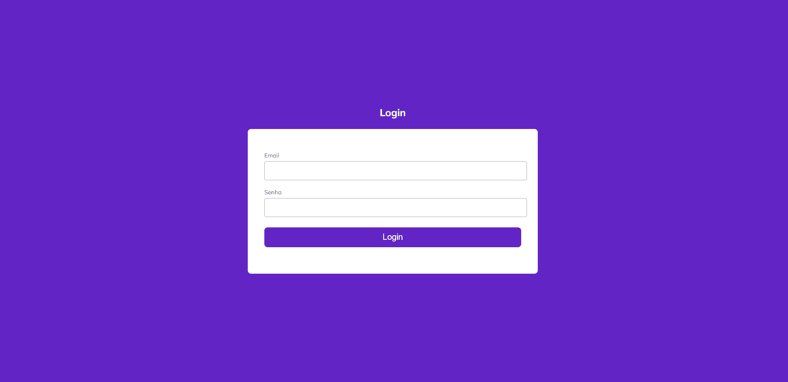
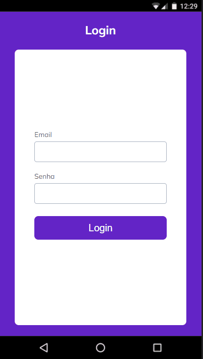
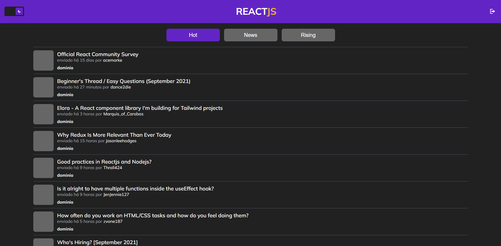
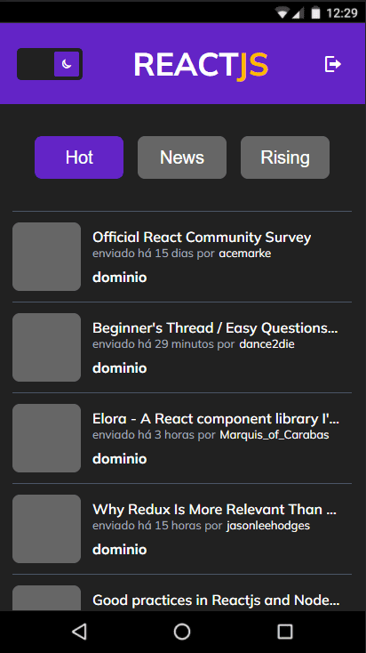
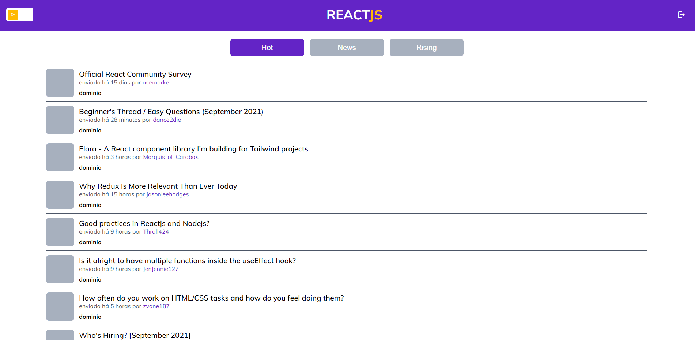
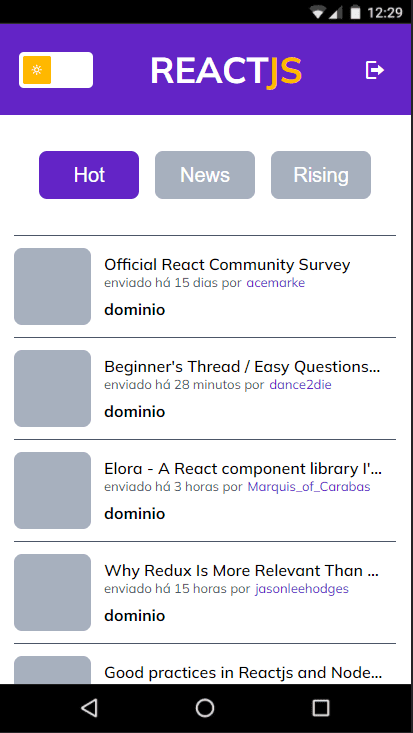

# Desafio Front-End Winnin

### ReactJS v17.0.0

 
Desenvolvimento de um feed do Reddit bucando dados especificamente do subreddit [reactjs](https://www.reddit.com/r/reactjs/).

O projeto pode ser visualizado neste link: https://winnin-test.herokuapp.com/

 

Oque foi desenvolvido:

---

> ### Foco Principal
>
> 1.  Estruturação de pastas.
> 2.  Desenvolvimento da tela baseado do [Figma](https://www.figma.com/file/PPvIPPITdlgZo9CeGDVezk/DesafioWinnin?node-id=0%3A1).
> 3.  Responsividade.
> 4.  Filtragem por Hot, News e Rising
> 5.  Infinity scroll controlada pelo botão 'Ver mais'
> 6.  TypeScript
> 7.  Mensagens de erro
> 8.  Contexts
>
> ### Extra
>
> 1. Testes Unitários Jest
> 2. Autenticação com página de login e rotas privadas
> 3. Integração com a API de login https://reqres.in/
> 4. Lint
> 5. Prettier
> 6. Loading: página, skeleton e botão
> 7. Husky (pré-commit)
> 8. Dark Mode (100% puro)
> 9. Deploy Heroku
> 10. Environments
>
> #

---

 

Executando o projeto:

---

    $ git clone https://github.com/erickkf600/winnin-test.git

    / entre na pasta do projeto

    $ npm install

---

 

-   finalizada a clonagem, edite o arquivo `example.env.local` para `.env.local`

---

    $ npm run start:dev

---

 

Dados para autenticação:

---

    email: eve.holt@reqres.in

    senha: cityslicka

---

 
Executando lint:

---

    $ npm run lint

    / ou para possiveis correções

    $ npm run lint:fix

---

 
Executando Teste Unitários:

---

    $ npm run test

    / ou para carregar o coverage

    $ npm run test:coverage

---

 

Preview:

---

> ### LOGIN
>
> 
> 
> 
> 

> ### DARK
>
> 
> 
> 
> 

> ### DARK
>
> 
> 
> 
> 

  

#### Arquitetura do Projeto

---

 
Abrir

 <pre>
├───assets
│   ├───icons
│   │   └───fonts
│   ├───imgs
│   └───preview
├───components /* Components compartilhados globalmente */
│   ├───ComponentLoader
│   ├───ErrorMessage
│   ├───Header
│   ├───Skeleton
│   └───ToggleButton
├───interfaces
├───pages
│   ├───Home
│   │   └───filter /* Componente interno */
│   └───Login
├───routing
├───services
│   ├───http /* Requisições */
│   ├───providers  /* Context API */
│   └───utils /* Funções Uteis */
└───styles
    ├───components
    ├───layout
    └───utils
 </pre>

  

#### Libs Utilizadas

---

-   [normalize.css](https://necolas.github.io/normalize.css/)
-   [React Hook Form](https://react-hook-form.com/)
-   [Yup](https://www.npmjs.com/package/yup)
-   [Sass](https://sass-lang.com/)
-   [React Router Dom](https://reactrouter.com/web/guides/quick-start)
-   [Classnames](https://www.npmjs.com/package/classnames)
-   [Axios](https://github.com/axios/axios)

#### DEV dependencies

---

-   [jest](https://jestjs.io)
-   [husky](https://typicode.github.io/husky/#/)
-   [prettier](https://prettier.io/)
-   [eslint](https://eslint.org/)

-   [jest - Plugins]()

    -   [@testing-library/dom]()
    -   [@testing-library/jest-dom]()
    -   [@testing-library/react]()
    -   [@types/jest]()

-   [EsLint - Plugins](#EsLintPlugins)
    -   [eslint-config-prettier]()
    -   [eslint-plugin-prettier]()
    -   [eslint-plugin-import]()
    -   [eslint-plugin-jsx-a11y]()
    -   [eslint-plugin-react]()
    -   [eslint-plugin-react-hooks]()

  

## Responsável

<table>
  <tr>
    <td align="center">
      <a href="#">
         
        
          <b>Erick Ferreira</b>
        
      </a>
    </td>
  </tr>
</table>
